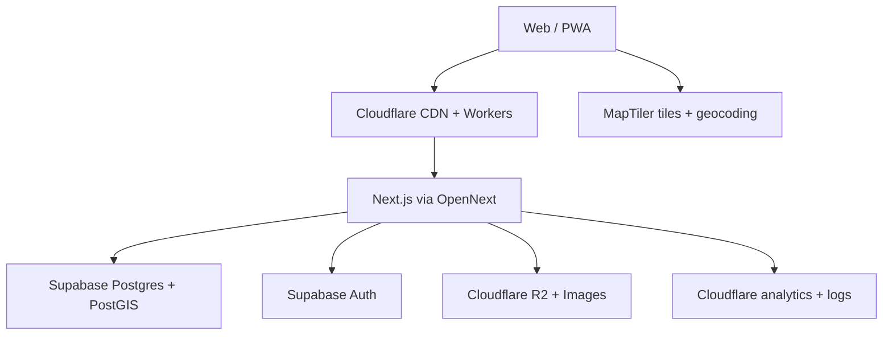

# Nib Atlas MVP Architecture

**Status:** Recommended production architecture
**Version:** 1.1
**Last updated:** 4 September 2026

## Architecture summary

Nib Atlas uses a conventional portable web stack, with Cloudflare where its edge and asset services are materially useful and Supabase where managed Postgres/PostGIS is materially stronger.

Do not use Cloudflare D1 for canonical shop/user data. Nib Atlas depends on indexed viewport and distance queries, relational integrity, RLS, and a future-compatible data model; PostgreSQL with PostGIS is the better operational choice.

## Technology decisions

### Frontend framework

**Recommendation:** current supported Next.js App Router with TypeScript and React.

Use:

- Server Components for shop pages and mostly static/editorial content.
- Client Components for map, filters, bottom sheet, synchronized selection, and stamp ceremony.
- Tailwind CSS with semantic CSS variables.
- Radix UI or React Aria primitives only where they reduce accessibility risk.
- A small motion dependency only if native CSS/Web Animations is insufficient.

Why:

- stable shareable/SEO-friendly shop routes;
- mature React ecosystem;
- one codebase for interactive and server-rendered surfaces;
- strong documentation and hiring path;
- supported deployment to Cloudflare Workers through OpenNext.

Lock-in: low–moderate. Next.js conventions require migration work, but TypeScript/React and domain modules are portable. Keep Cloudflare bindings out of React components.

### Backend/API approach

**Recommendation:** Next.js Route Handlers/server actions as the public application API; Postgres functions/RPC for geospatial queries and atomic stamp issuance.

Rules:

- Browser reads public shop projections through versioned application endpoints.
- Authenticated user state may use Supabase client/RLS for simple own-row reads, but privileged writes stay server controlled.
- Stamp issuance is a single server transaction/function, never a direct browser insert.
- Service-role credentials remain in Cloudflare Worker secrets.
- Provider clients sit behind `src/server/adapters` interfaces.
- Version API contracts explicitly when breaking changes become necessary; do not leak raw provider response shapes.

Suggested endpoints:

- `GET /api/v1/shops/viewport`
- `GET /api/v1/shops/search`
- `GET /api/v1/shops/[slug]`
- `PUT|DELETE /api/v1/saved-shops/[shopId]`
- `POST /api/v1/stamps/verify`
- `POST /api/v1/stamps/collect`
- protected `/api/v1/admin/*`

For Cloudflare-to-Supabase access, begin with `supabase-js`/HTTPS and Postgres RPCs. Do not add Hyperdrive until measured latency or connection pressure justifies it.

### Database

**Recommendation:** Supabase managed PostgreSQL with PostGIS.

Why:

- native relational constraints and migrations;
- GiST-indexed geometry;
- `ST_Intersects` viewport search and `ST_DWithin` distance checks;
- Supabase Auth integration and Row Level Security;
- ordinary PostgreSQL export/migration path.

Enable through migrations:

- `postgis`
- `pg_trgm`
- `pgcrypto` as required for UUID support

Evaluate PGroonga only after real multilingual search testing. Do not install extensions pre-emptively.

Lock-in: low for data, moderate for Auth/RLS integration. Database contents are standard PostgreSQL/PostGIS; auth-user migration and Supabase-specific APIs require work.

### Geographic and viewport querying

**Recommendation:** server-side PostGIS RPCs with bounded GeoJSON results and client-side MapLibre clustering for MVP.

- Query only committed viewport bounds.
- Handle antimeridian explicitly.
- Cap individual shop results.
- Cache public projections by rounded viewport, zoom, and filter hash.
- Merge authenticated saved/visited state separately.
- Move low-zoom aggregation to server clusters/PostGIS vector tiles only when density requires it.

Target budgets for MVP staging on representative synthetic data:

- p95 viewport database execution under 250 ms at expected launch density;
- p95 application endpoint under 600 ms from Singapore/Japan/Taiwan regions excluding cold start/network extremes;
- marker payload under 250 KB compressed for a typical dense-city viewport;
- hard result cap documented in the API contract.

### Map provider

**Recommendation:** MapLibre GL JS renderer with MapTiler Cloud for vector tiles, styles, and destination geocoding.

Why:

- MapLibre is open source and supports custom vector styling/clustering.
- MapTiler provides a managed commercial tile/geocoding service appropriate for a small team.
- The renderer remains separable from the supplier.

Create application interfaces:

- `MapStyleProvider`
- `DestinationGeocoder`
- `MapTelemetry`

Do not store MapTiler response objects in domain state. Restrict public keys by allowed origins where supported and set spending alerts/limits.

Lock-in: moderate for style JSON and geocoding behavior; low for renderer.

### Authentication

**Recommendation:** Supabase Auth.

Sequence:

1. Email OTP/magic link in the first authenticated milestone.
2. Google OAuth before public beta.
3. Custom SMTP sender/domain before production.

Authorization is enforced by RLS plus server-side role checks. Store application roles in `profiles`/controlled claims, never client-editable metadata. Authentication must preserve return-to-intent.

Lock-in: moderate. JWT-based architecture is portable, but user/provider migration is not free.

### Image storage and delivery

**Recommendation:** private/admin-write Cloudflare R2 bucket plus Cloudflare Images transformations/delivery through a Nib Atlas domain.

- Store provider-neutral `storage_key` in Postgres.
- Keep rights, credit, source, alt text, dimensions, and moderation state in Postgres.
- Use a small fixed variant set: card, detail, thumbnail, social.
- Validate type, dimensions, file size, and metadata on upload.
- For approved stamp artwork, variants may resample the complete `3:2` canvas
  only. They must not crop, recolour, add text, translate over, redraw or apply a
  stylistic filter. Store the approved exports and checksums so the published
  bytes can be verified against the illustrator's written approval.
- Do not allow general public uploads in MVP.

R2 offers a 10 GB-month free tier and free internet egress; Images includes 5,000 unique transformations before paid transformation usage. Budget modest overage rather than assuming permanent zero cost.

Lock-in: low–moderate. R2 is S3-compatible; transformation URLs and bindings require adapter changes.

### Hosting and edge services

**Recommendation:** Cloudflare Workers Paid plan using the OpenNext adapter.

Cloudflare owns:

- DNS and TLS;
- CDN/static delivery;
- Next.js Worker runtime;
- Turnstile on abuse-prone/auth/admin surfaces;
- rate limiting where available/appropriate;
- R2 and image transformation;
- Web Analytics, Worker logs, and Analytics Engine events.

Most current Next.js features are supported by Cloudflare’s OpenNext adapter, but preview/integration checks must run in the Cloudflare runtime rather than assuming full Node equivalence.

Lock-in: moderate at the deployment/bindings layer. Keep configuration in `infra/cloudflare` and access through narrow adapters.

### Analytics and observability

**Recommendation:** Cloudflare Web Analytics for page-level privacy-respecting traffic plus Workers Analytics Engine for a small explicit product-event taxonomy.

Initial events:

- `map_view_committed`
- `destination_searched`
- `shop_opened`
- `shop_saved`
- `directions_opened`
- `stamp_verification_result`
- `stamp_collected`
- `passport_opened`

Never send precise coordinates, raw search text containing personal data, access tokens, or public Passport history. Add Sentry/PostHog only if concrete debugging or funnel needs exceed the Cloudflare baseline.

Operational monitoring:

- structured request ID;
- sampled Worker logs;
- API error rate and latency;
- verification failure reason counts;
- Supabase database health/backups;
- map and storage spend alerts.

### Admin tooling

**Recommendation:** founder-only `/admin` inside the same application.

Build only:

- shop/stamp CRUD;
- preview/publish workflow;
- provenance and image-rights fields;
- dry-run import and validation report;
- limited anomaly/audit view.

Do not introduce Retool, Directus, a merchant dashboard, or a general CMS until administrative volume demonstrates the need.

## Environment strategy

### Local development

- Supabase CLI local stack with migrations and deterministic fixtures.
- Local Next.js dev server.
- Map provider mocked for unit/component tests; developer MapTiler key only for manual map work.
- R2 adapter uses Miniflare/local binding or fixture asset service.
- `.env.example` documents names only; `.env.local` is ignored.

### Pull-request preview

- GitHub Actions runs static checks, database tests, component tests, and selected Playwright tests.
- Cloudflare preview deployment is created for frontend/integration PRs when practical.
- Preview connects only to staging/dev data and is visibly marked **Demo / Not production data**.
- No production secrets or production Supabase service role are exposed to preview jobs.

### Staging

- Long-lived `staging.nibatlas…` Worker/environment.
- Dedicated Supabase staging project.
- Separate R2 bucket/prefix, auth callback URLs, MapTiler key, and analytics dataset.
- Receives merges to `staging` or an explicit promotion workflow.
- Contains sanitized demo/pilot data, never a casual copy of production user data.

### Production

- `main` is deployable source of truth.
- Production deployment requires passing CI and an explicit environment approval when the GitHub plan supports it.
- Dedicated Supabase production project, R2 bucket, keys, OAuth application, and domain.
- Database migrations run as a gated deployment step before application promotion, with backup/rollback notes.

## CI/CD

### Pull request CI

Run on every PR:

1. dependency lockfile integrity;
2. formatting/lint;
3. strict TypeScript;
4. unit/component tests;
5. Supabase migration reset from empty;
6. SQL/RLS tests;
7. API contract tests;
8. Playwright smoke tests at mobile and desktop widths;
9. accessibility checks;
10. build with Cloudflare/OpenNext compatibility check.

### Deployment flow

- Feature branches → draft PR → review → merge.
- `staging` deployment from a controlled branch/workflow.
- Production promotion to `main` after staging acceptance.
- Use GitHub Actions and `wrangler` for auditable deploys; do not rely on manual dashboard uploads.
- Store secrets in GitHub Environments where available and Cloudflare Worker secrets; never in repository variables or committed files.
- Generate deployment summaries containing commit SHA, migration list, environment, and rollback instructions.

### Branch/agent coordination

- `main`: production/deployable source of truth.
- `staging`: optional integration/promotion branch; keep short-lived and regularly synchronized.
- `agent/claude-*`: Claude Code frontend work.
- `agent/codex-*`: Codex backend/platform work.

Prefer short-lived branches and PRs over permanent `claude/frontend` and `codex/platform-foundation` branches, which drift and create integration debt. Only one agent edits migrations, root package configuration, generated types, deployment configuration, or CI in a given milestone.

## Security and privacy baseline

- RLS explicitly enabled in SQL migrations.
- Public read only for published content projections.
- Stamp issuance server-controlled, nonce-protected, throttled, and idempotent.
- CSRF-safe authenticated writes.
- Turnstile/rate limits on abuse-prone endpoints after threat review.
- Location requested only for Near Me or Collect Stamp.
- No raw coordinates in DB, analytics, or logs.
- Passport and saves private by default.
- Admin actions audited.
- Account export/deletion and plain-language privacy page before launch.
- Dependency and secret scanning enabled in GitHub.

## International content and interface localisation

Shop content and interface translations are separate concerns:

- Country codes use the ISO 3166-1 alpha-2 shape and country labels come from
  `Intl.DisplayNames`. Adding a sourced country therefore does not require a new
  frontend release solely to extend a union or label map.
- Each local shop name carries its own BCP 47 language tag. The application does
  not infer a name's language from its country, because countries can be
  multilingual and scripts can differ within one language.
- The interface remains English until another interface locale is deliberately
  approved and translated. At that point, use `next-intl` with one statically
  authored message catalogue per shipped locale, loading only the selected
  locale's messages. Persist an explicit user choice; browser preference may
  provide a first-visit default but must not override that choice.
- Do not translate UI strings at request time or ship every prospective language.
  Translation, editorial review, accessibility review, and visual QA are the
  material costs. Dependencies, message catalogues, locale routing, and extra
  font assets should be introduced only with the first approved non-English UI
  locale.

This keeps sourced catalogue expansion independent from the cost and release
schedule of interface translation.

## Expected MVP operating cost

All figures are USD, before tax/overage, based on public pricing checked 11 August 2026.

### Development/private prototype

| Service | Expected |
| --- | ---: |
| Cloudflare Workers Free or Paid only when runtime testing requires it | $0–5 |
| Supabase Free local/dev project | $0 |
| MapTiler Free for testing/non-commercial use | $0 |
| R2/Images within free tiers | $0 |
| Domain amortized | about $1–2 |
| **Total** | **about $1–7/month** |

### Public commercial MVP

| Service | Assumption | Expected |
| --- | --- | ---: |
| Cloudflare Workers Paid | 10M included requests/month and included CPU allowance | $5 |
| Supabase Pro | First production project/Micro credit | $25 |
| MapTiler Flex | 25k map sessions + 3k search sessions included | $30 |
| R2 | Under 10 GB and included operations initially | $0–2 |
| Cloudflare Images | Under/near included transformations initially | $0–3 |
| Auth email provider/custom SMTP | Early free tier | $0 |
| Domain | Annual cost amortized | $1–2 |
| **Baseline** | Before taxes/overage | **about $61–67/month** |

A dedicated always-on paid staging Supabase project may add roughly $10/month. Practical early range with staging and modest overages: **$61–80/month**. Labour, shop research, field verification, photography/licensing, legal/privacy review, and stamp artwork are separate and likely exceed infrastructure cost.

Cost controls:

- explicit **Search this area** rather than gesture-triggered requests;
- geocoder debounce/cache;
- bounded marker payloads;
- fixed image variants;
- separate public and user state for cacheability;
- provider spend alerts and MapTiler spending limit;
- free/local development environments where safe.

## Meaningful vendor lock-in

| Vendor | Lock-in | Mitigation |
| --- | --- | --- |
| Cloudflare Workers/OpenNext | Moderate | Keep bindings/adapters isolated; verify standard Next.js build; document env contract |
| Cloudflare R2/Images | Low–moderate | S3-compatible object keys; own domain; fixed transform adapter |
| Supabase Postgres/PostGIS | Low | Standard SQL, versioned migrations, routine exports |
| Supabase Auth | Moderate | Domain user IDs decoupled where practical; documented JWT/role contract |
| MapTiler | Moderate | MapLibre renderer; provider interfaces; domain model never stores supplier payloads |
| GitHub Actions | Low–moderate | Scripts runnable locally; avoid logic embedded only in YAML |

## Official references

- [Cloudflare Next.js/OpenNext support](https://developers.cloudflare.com/workers/framework-guides/web-apps/nextjs/)
- [Cloudflare Workers pricing](https://developers.cloudflare.com/workers/platform/pricing/)
- [Cloudflare R2 pricing](https://developers.cloudflare.com/r2/pricing/)
- [Cloudflare Images pricing](https://developers.cloudflare.com/images/pricing/)
- [Supabase pricing](https://supabase.com/pricing)
- [Supabase Row Level Security](https://supabase.com/docs/guides/database/postgres/row-level-security)
- [Supabase PostGIS](https://supabase.com/docs/guides/database/extensions/postgis)
- [MapTiler pricing](https://www.maptiler.com/cloud/pricing/)
- [GitHub deployment environments](https://docs.github.com/en/actions/how-tos/deploy/configure-and-manage-deployments/manage-environments)

## Milestone 5 WP2 verification boundary

The cookie/verified-claims Worker authenticates three same-origin endpoints:
`stamps/nonce`, `stamps/verify`, and `stamps/collect`. Only its isolated service
client can invoke the transactional verification RPC; catalogue/auth/saved
clients remain unprivileged. Per-nonce encrypted envelopes protect raw GPS from
database parameter logs. Database cron enforces diagnostic retention. See the
[API contract](docs/api/stamp-verification-v1.md) and
[operations runbook](docs/runbooks/stamp-verification.md).

WP3 adds a cookie/verified-claims `GET /api/v1/collections` using the ordinary
owner client and a bounded owner-scoped RPC. The account collection provider
keeps history in memory, isolates it from prototype storage, and reconciles
map/shop/Passport from the same collection IDs. See
[collection v1](docs/api/collections-v1.md).

The named-project staging deployment also applies the separately guarded phone
fixture atomically. This fixture is excluded from the default seed and production
imports; no location-policy overrides or competing image storage are added.

## Milestone 6 WP1 admin boundary

Admin access uses an ordinary cookie-bound client and live `profiles.role` RPC
checks, with a second role check inside privileged audit reads. No service role
or client-editable metadata grants admin access. The only role assignment path
is the database-owner procedure, with an atomic role-change audit trigger.
See [admin setup and limitations](docs/runbooks/admin-authorization.md).

M6 WP2 adds ordinary cookie-client shop RPCs with role checks inside each read and
write transaction, same-origin bounded HTTP mutations and revision conflicts.
Private working copies are published atomically; public catalogue responses use
no-store to reflect closure/archive on a fresh request. No service key is used.
See `docs/adr/0012-shop-administration.md` and the shop administration runbook.
